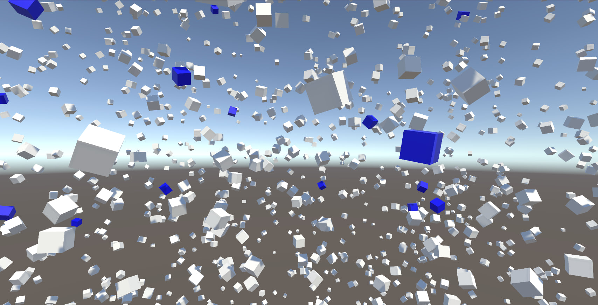

# Matrix Matcher & Visualizer for Unity  



Этот проект реализует алгоритм сопоставления матриц с использованием 4×4 трансформационных матриц в Unity.  
Визуализирует найденные соответствия в виде цветных кубов.  

## 📂 Структура проекта  
- **Assets/Scripts/** – код программы  
- **Assets/StreamingAssets/** – JSON-файлы с данными  
- **README.md** – описание проекта  

## 🚀 Установка  
1. Клонируйте репозиторий:  
   ```bash
   git clone https://github.com/skrininshot/Ceramic3d_test-task.git
   ```
2. Откройте проект в Unity (2021+).
3. Убедитесь, что в StreamingAssets лежат model.json и space.json.
4. Запустите сцену в Unity.

## 🖥 Как работает?
1. **MatrixMatcher** загружает матрицы из JSON.
2. Сопоставляет модели и пространство по вращательным блокам.
3. Генерирует кандидатов смещений.
4. Отображает найденные совпадения с помощью цветных кубов.

## 🎨 Визуализация
    Синие кубы – матрицы модели
    Белые кубы – матрицы пространства
    Зелёные кубы – смещённые кубы после применения трансформаций

## 🛠 Разработчик
    [Егор] (Telegram: @skrininshot)